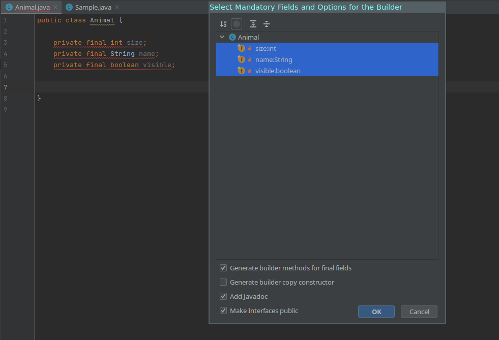
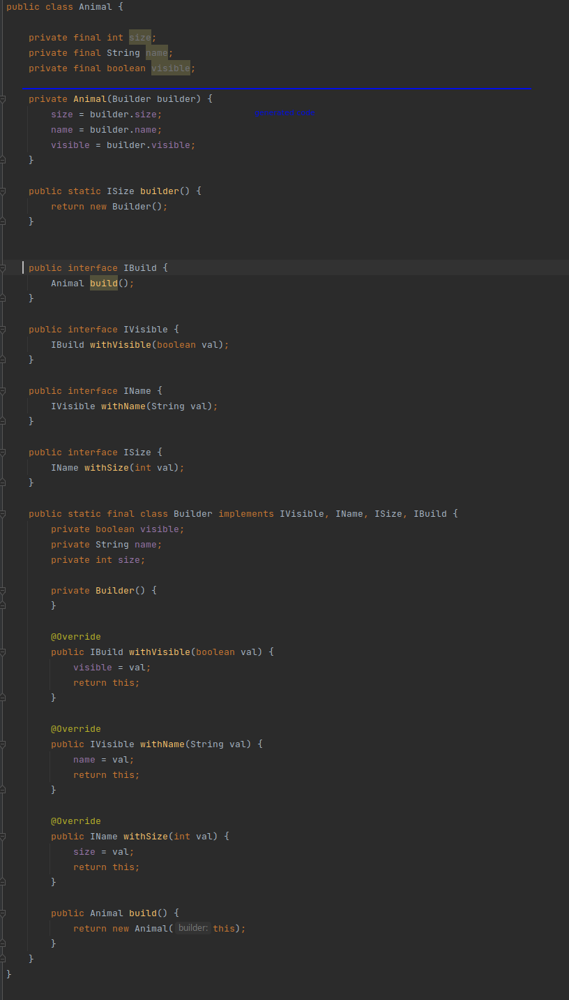

# intellij-stepbuilder-codegen-plugin


[](https://plugins.jetbrains.com/plugin/cookiecode-stepbuilder-plugin)
[](https://plugins.jetbrains.com/plugin/cookiecode-stepbuilder-plugin)

<!-- Plugin description -->
A plugin to generate step builders for your Java classes. 
With step builder, you can easily provide fluent creation for your objects (i.e: `Address.builder().ip("192.168.1.1").port(80).build();`

What is the difference with a basic builder ?

The step builder enforce all mandatories (private final fields) to be setted you can never forget to provide a 
property anymore and it also enforce the order of declaration of elements.

In a normal builder you might forget some `withName()` invokation and the compilation will be fine. With a step builder, you cannot 
invoke `.build();` while you didn't invoke all the required `withXZY()` methods.


<!-- Plugin description end -->

## Installation

- Using IDE built-in plugin system:
  
  <kbd>Settings/Preferences</kbd> > <kbd>Plugins</kbd> > <kbd>Marketplace</kbd> > <kbd>Search for "Stepbuilder Codegen"</kbd> >
  <kbd>Install Plugin</kbd>
  
- Manually:

  Download the [latest release](https://github.com/sebastienvermeille/intellij-stepbuilder-codegen-plugin/releases/latest) and install it manually using
  <kbd>Settings/Preferences</kbd> > <kbd>Plugins</kbd> > <kbd>⚙️</kbd> > <kbd>Install plugin from disk...</kbd>

## Usage
Create a small class having some properties such as:
```java
public class Animal {
  
  private final int size;
  private final String name;
  private final boolean visible;
}
```

Alt + insert:


Then select **Generate Step Builder**:



Choose the fields you like to have in your step builder
And you can also specify some custom options such as javadoc or not etc.

Click **OK**

And voila you have your generated step builder right away:



---
This project is a maintained fork of: https://github.com/iamMehedi/stepbuilder

I try to keep it running for new versions of intelliJ feel free to contribute to it if you have ideas :)

Plugin based on the [IntelliJ Platform Plugin Template][template].

[template]: https://github.com/JetBrains/intellij-platform-plugin-template
